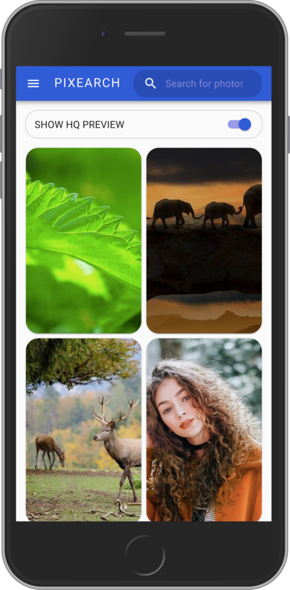
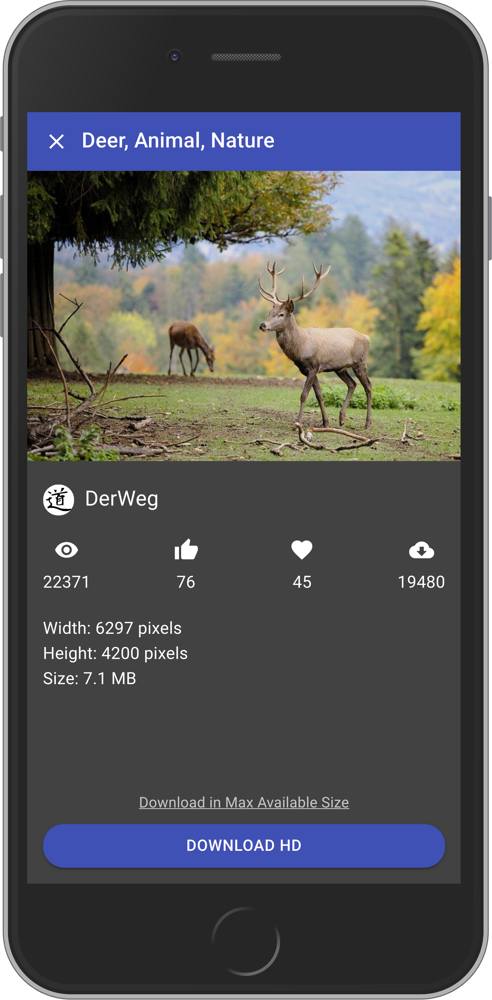
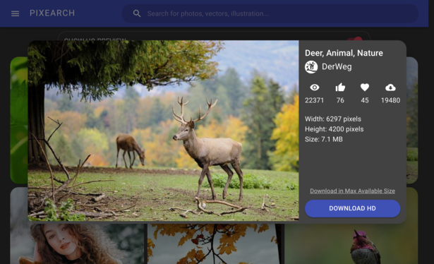

# [Pixearch deployed at netlify](https://pixearch.netlify.app)

### Screenshots

## This project is not open sourced yet. This repository is for bug tracking only.

### Feel free to create an issue in the issues tab

## Known Issues

- Can't press back to close the dialog
- Small search field in mobile device
- Double drawer in desktop mode

## TO-DO

- [ ] Add more options
- [ ] Fix bugs
- [ ] Implement routing for dialog
- [ ] Probably move the side drawer in top dropdown style
